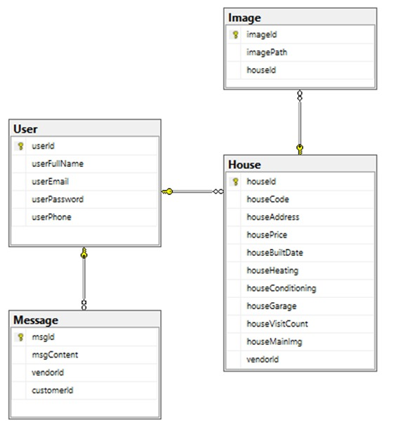

# Proje tanıtımı
Web sitesi gayrimenkulleri görüntüler ve konut mülkleri ve kiracıların satıcı ve alıcılarına geniş bir hizmet yelpazesi sunar. Ayrıca, kullanıcıların her eve bazı ayrıntıların bir açıklamasını ve bir dizi resim sağlamaları için kolay ve basitleştirilmiş bir arayüz sağlar. Ve satıcılar ve alıcılar arasındaki iletişim sürecini kolaylaştırır
# Proje Açıklaması
Siteyi herkes gezebilir ve hizmetlerini görebilir, sadece satmak, satın almak veya kiralamak isteyenlerin hesap oluşturup siteye giriş yapması ve ayrıca hizmet vermek isteyenlerin (kiralık veya satılık ev)  hesap oluştur gerekir. . Kullanıcı siteden ev satın almak, satmak veya kiralamak istediğinde, sağlayıcıya bir e-posta göndererek hizmet sağlayıcı (ev sahibi) ile iletişime geçmelidir, burada site hizmet sağlayıcılar için iletişim bilgilerini kaydeder ve ayrıca iletişime geçebilir.
# database
